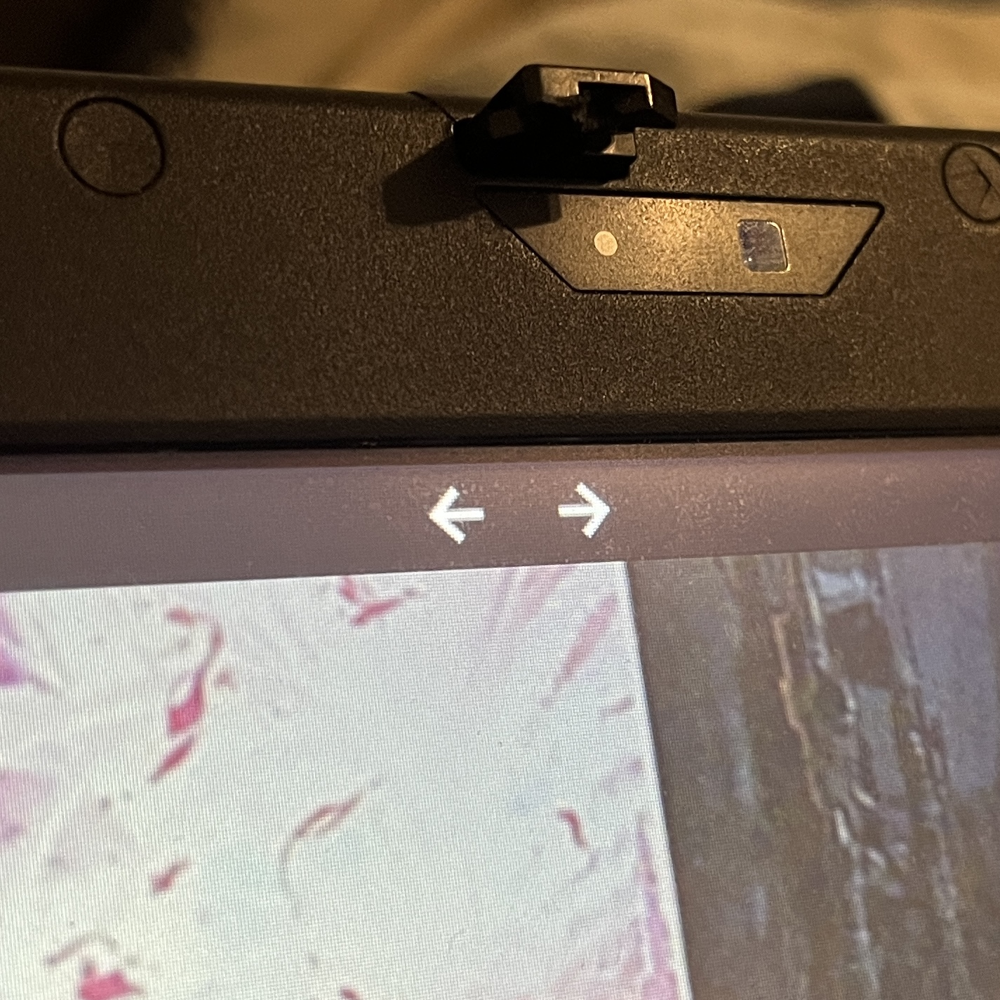
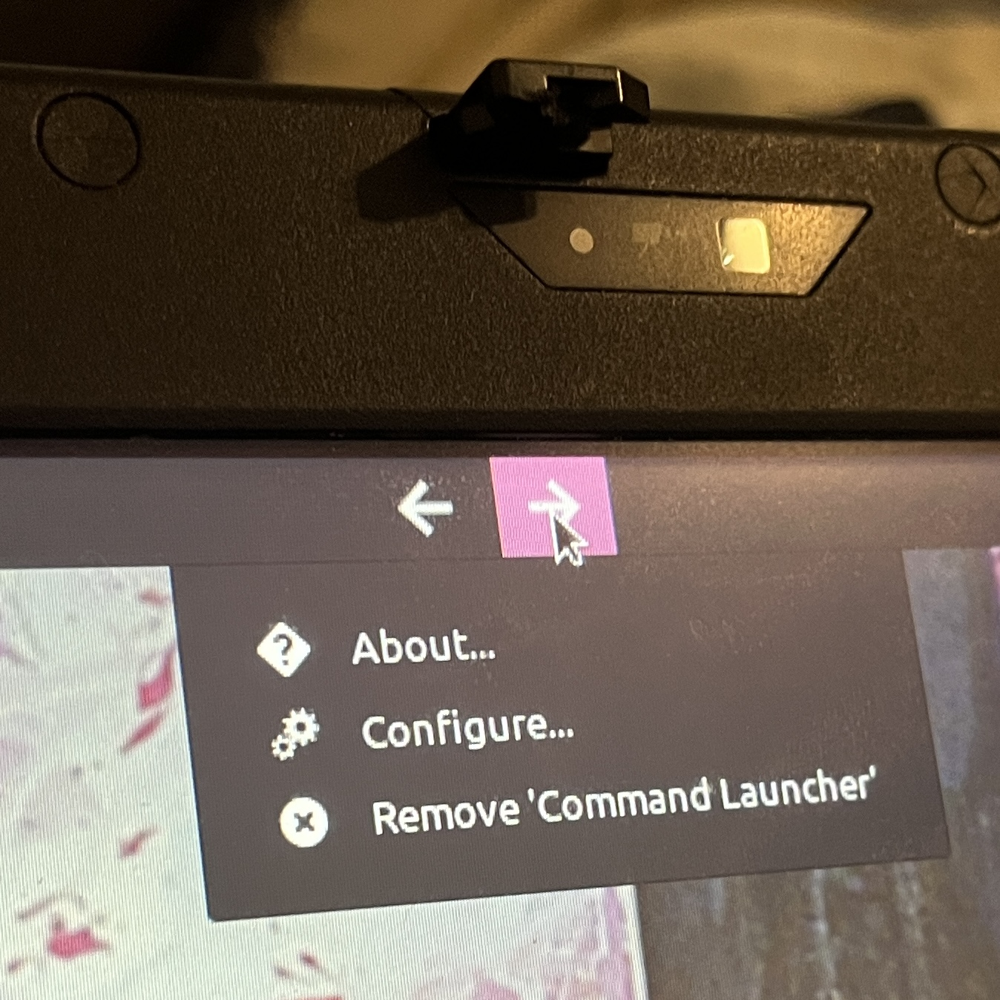
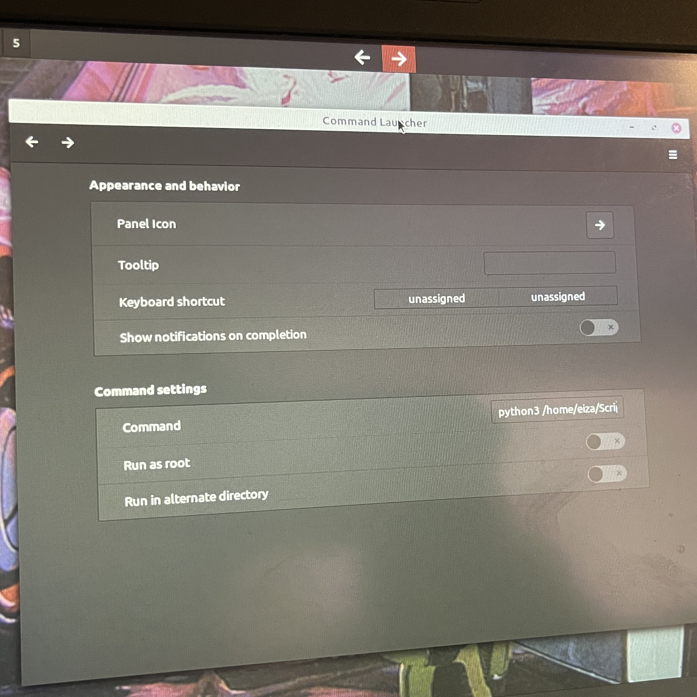

# x201-tablet-rotate-driver

A Python script that rotates and calibrates the ThinkPad X201 Tablet display with **xrandr** and **xsetwacom** in Linux Mint Cinnamon 19.


## Demo

<table>
</thead>
<tbody>
</tbody>
	<tr>
		<td width="140">
			Rotating Right (Portrait)
		</td>
		<td width="185">
			python3 driver.py -d -1
		</td>
		<td>
			
		</td>
	</tr>
	<tr>
		<td>
			Rotating Left (Landscape)
		</td>
		<td>
			python3 driver.py -d 1
		</td>
		<td>
			
		</td>
	</tr>
	<tr>
		<td>
			Rotating Left (Portrait)
		</td>
		<td>
			python3 driver.py -d 1
		</td>
		<td>
			
		</td>
	</tr>
	<tr>
		<td>
			Automatic Calibration After Any Rotation
		</td>
		<td>
			GIF: after each rotation, the display is calibrated to where the movement of the cursor is accurate and consistent.
		</td>
		<td>
			
		</td>
	</tr>
</table>

## Setup and Use

### Command Line

Since it supports command-line arguments, the script can be used manually in the terminal.

To rotate the display 90 degrees counter-clockwise to the "left," run:
```
python3 driver.py -d 1
```
...which is the same as running the script without any arguments:
```
python3 driver.py
```

To rotate the display 90 degrees clockwise to the "right," run:
```
python3 driver.py -d -1
```

### Widget

It is much more ideal and efficient to execute the command through a touchscreen-friendly widget:

<table>
</thead>
<tbody>
</tbody>
	<tr>
		<td width="256">
			In my particular setup, I used two "Command Launcher" widgets: one to rotate clockwise, another to rotate counterclockwise. Command-executing widgets should be available in many other desktop environments such as XFCE, KDE, or MATE, to name a few.
		</td>
		<td>
			
		</td>
	</tr>
	<tr>
		<td>
			To configure the widgets in Cinnamon, simply right click one and click on "Configure..."
		</td>
		<td>
			
		</td>
	</tr>
	<tr>
		<td>
			At a minimum, update the "command" field of the left and right widgets:
		<table>
		</thead>
		<tbody>
		</tbody>
			<tr>
				<td>
					LEFT
				</td>
				<td>
					python3 PATH -d 1
				</td>
				</tr>
			<tr>
				<td>
					RIGHT
				</td>
				<td>
					python3 PATH -d -1
				</td>
			</tr>
		</table>
			...where "PATH" is the ABSOLUTE path to the driver.py file (relative paths are not recommended here). The script does NOT need to be ran as root. You may also optionally adjust the widget icon, keyboard shortcut, notification, etc.
		</td>
		<td>
			
		</td>
	</tr>
</table>

## Rationale and Motivation for the Project

### Reason #1: Calibration Completely Broken in Linux Mint

At first, writing a script like this was not necessary: the built-in tablet calibration in Linux Mint Cinnamon 19 worked perfectly... until it didn't.

For context, the ThinkPad X201 Tablet is a 2-in-1 laptop with a Wacom-based display that supports a stylus and touchscreen. Normally when rotating the display, it is expected that the calibration that you set with the Linux Mint utility will remain consistent, no matter the orientation, no matter how much you rotate the display: the cursor would go where your stylus and fingers went.

However, some update had broken this functionality: the calibrations set with the utility will no longer stay whenever the display is rotated. The stylus and touchscreen was not off by a mere few pixels; the cursor would be stuck in a corner of the screen and the display was effectively unusuable.

### Reason #2: Forced to Rotate with Keyboard Shortcuts
Another issue unrelated to the calibration was how the display also did not rotate when you physically moved the device around; you needed to tell the system to rotate the display in software as a keyboard shortcut.

This is not entirely at the fault of Linux Mint as the device does not have sensors to detect its orientation automatically, but it would be nice if I was not limited to rotating the screen by hitting a physical button; I wanted an on-screen button or widget that was much more flexible and customizable.

### Making the Project
The project was meant to solve both issues with a simple Python script.

As a Python file, the screen could be rotated with a keyboard shortcut, widget, from the terminal, anything that could run shell commands (a lot of things can). 

Furthermore, the Python script could perform many actions in one go: the screen could be rotated and then the script could re-calibrate the screen after the rotation, thus solving the aforementioned calibration issue.
